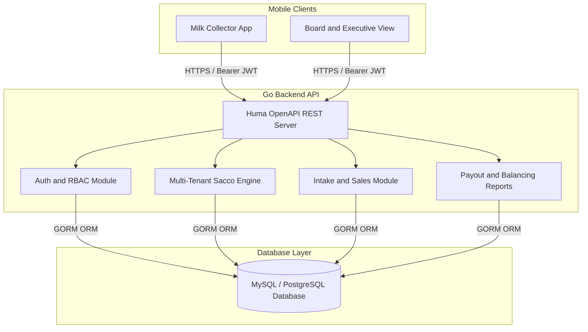

# 👑 DairyGo — Next-Gen Dairy Sacco & Milk Collection Management Platform

[](https://golang.org)
[](https://flutter.dev)
[](https://www.docker.com/)
[]()
[]()

> **DairyGo** powers modern Dairy Co-operatives & Saccos with real-time field milk intake recording, direct sales tracking, dynamic per-litre pricing, automated farmer payout ledgers, and executive board analytics.

---

## 📖 Executive Summary

Dairy Co-operatives across East Africa process thousands of litres of milk daily, relying on field collectors navigating remote routes. **DairyGo** bridges field operations with executive boardroom decision-making by eliminating manual paperwork and providing a reliable, offline-friendly mobile interface paired with a high-concurrency Go backend.

With **DairyGo**:
* **Field Milk Collectors** record morning/evening farmer milk intake, log direct sales to buyers/hotels, and register spoilage losses on-the-go.
* **Sacco Administrators** manage milk buying rates, provision staff user accounts, and configure operational parameters.
* **Executive Board Members** gain instant visibility into daily Sacco intake trends, revenue totals, active collector performance, and farmer payout liabilities.

---

## 🏗️ System Architecture



---

## 🌟 Key Platform Features

### 🥛 1. Field Milk Intake & Sales Operations
* **Farmer Intake Log**: Fast farmer search by membership code/phone and instant litre recording.
* **Customer Sales**: Every litre leaving a collector is a sale to a customer (coolers, processors, hotels, shops, individuals). Collectors search or add the customer on the spot; agreed prices prefill.
* **Customer Ledger**: Credit and part-paid sales build a running balance per customer; admins record M-Pesa/cash/bank payments, and admins and board members see statements and who owes what.
* **Spoilage Tracking**: Log transit milk loss and spoilage events to ensure daily intake balancing.

* **Trustworthy Records**: Collections only for active farmers of the Sacco, priced by the rate in force on the collection date. Controlled edits (collectors same-day on their own entries, admins with a reason) and a full audit history of every change.

### 📊 2. Executive Board Analytics
* **Milk Balance**: Every litre collected must be sold (coolers included) or logged as spoilage. Unaccounted milk is flagged as *missing* or *oversold* per collector and per Sacco, within a configurable tolerance.
* **Real-time Overview Cards**: Intake, sales, spoilage, today's balance status, month gross margin, what customers owe, active farmers and collectors.
* **Daily Trend Graphs**: Dynamic 7-day, 14-day, and 30-day milk volume time-series charts.

### 💰 3. Dynamic Sacco Milk Pricing Engine
* **Per-Litre Buying Rates**: A schedule of buying prices with effective dates; each collection is priced by the rate in force on its date, and future rates start automatically.
* **Farmer Payout Statements**: Gross earnings per farmer over any period (litres × the rate in force on each collection date), with M-Pesa and bank payout details.

### 🏢 4. Multi-Tenant Sacco Architecture
* **Tenant Isolation**: Independent Sacco configurations with isolated database records (`sacco_id` scope).
* **Super Admin Provisioning**: Platform-level onboarding for new Dairy Sacco tenants. Only platform super users (no `sacco_id`) can create or manage Saccos; each Sacco's own admin is a regular `Sacco Administrator` scoped to their Sacco.

### 🖥️ Platform Console
* **Web console at `/platform`** for DairyGo operators: all Saccos at a glance, onboarding, suspension, Sacco staff (add, deactivate, unlock, reset password), farmers, audit trail, error log and SMS logs. Served by the API, nothing extra to host.

### 🔐 5. Role-Based Access Control (RBAC)
* **Pre-seeded Roles**:
  * `Sacco Administrator` (Role ID `1`): Full operational and staff management access.
  * `Milk Collector` (Role ID `2`): Field mobile intake, sales, and spoilage access.
  * `Board Member / Executive` (Role ID `3`): Read-only executive dashboard and audit report access.
* **Code-First Permissions**: Synchronized via CLI tool (`dairy-cli auth sync`).

### ⏱️ 6. Continuous Field Session (30-Day Inactivity TTL)
* Designed for field agents: **30-day inactivity refresh token lifespan** with automatic background token rotation, eliminating daily re-login friction.

---

## 📂 Project Repository Structure

```
Dairy/
├── backend/                  # Go REST API Backend
│   ├── cmd/
│   │   ├── api/              # Main API server (cmd/api/main.go)
│   │   ├── migrate/          # Goose Database migration runner
│   │   └── tusk/             # DairyGo CLI Permission Sync tool (dairy-cli)
│   ├── config/               # App configuration & env loader
│   ├── database/
│   │   └── migrations/       # Goose SQL schema migrations (00001-00013)
│   ├── internal/
│   │   ├── auth/             # Authentication, Users, & Roles
│   │   ├── collection/       # Milk Collections, Sales, Spoilage, Pricing
│   │   ├── customer/         # Customers, payments, statements (ledger)
│   │   ├── dashboard/        # Executive & Collector Dashboard Analytics
│   │   ├── member/           # Sacco Farmer Directory
│   │   ├── report/           # Payroll Payout & Audit Reports
│   │   ├── sacco/            # Sacco Tenant Profile & Settings
│   │   └── superadmin/       # Platform console API (overview, staff, logs)
│   ├── web/platform/         # Platform console web app (embedded, served at /platform)
│   ├── Dockerfile            # Multi-stage production build
│   └── docker-compose.yml    # Container orchestration configuration
└── mobile/                   # Flutter Mobile Application
    ├── lib/
    │   ├── app/              # Router (GoRouter), Theme, App Shell
    │   ├── core/             # HTTP Client (Dio), Storage, Base Widgets
    │   └── features/
    │       ├── auth/         # Login, Auth Controller, State
    │       ├── collection/   # Intake, Field Sales, Spoilage UI & Controllers
    │       ├── dashboard/    # Collector Shift & Executive Dashboard Screens
    │       ├── customers/    # Customers, picker, statements & payments
    │       ├── members/      # Farmers Directory UI & Profile Screens
    │       ├── reports/      # Payout Statements & Collector Audit UI
    │       └── settings/     # Staff Registration & Price Configuration
    └── pubspec.yaml          # Flutter dependencies
```

---

## 🚀 Quick Start & Local Development

### 1. Prerequisites
* **Go**: `1.24+`
* **Flutter SDK**: `3.x+`
* **Docker & Docker Compose**
* **MySQL** or **PostgreSQL**

---

### 2. Backend Setup
```bash
cd backend

# Copy sample environment configuration
cp .env.example .env

# Start local backend development server (with hot reload via Air)
make dev

# Run Goose database migrations
make migrate-up

# Synchronize code-first permissions into database
go run ./cmd/tusk auth sync
```

---

### 3. Mobile App Setup
```bash
cd mobile

# Install dependencies
flutter pub get

# Generate freezed and Riverpod providers
flutter pub run build_runner build --delete-conflicting-outputs

# Launch mobile application on connected device/emulator
flutter run
```

---

## 🐳 Production Deployment with Docker

### 1. Launch Container Stack
```bash
cd backend

# Build and start container in background
docker compose up -d --build
```

### 2. Execute Schema Migrations & Permission Sync
```bash
# Run database migrations inside container
docker exec -it dairy-api ./dairy-migrate up

# Sync code permissions inside container
docker exec -it dairy-api ./dairy-cli auth sync
```

### 3. Check Container Health
```bash
# View live application logs
docker logs -f dairy-api

# Health check
curl http://localhost:9002/health
```

---

## 🔑 Core API Endpoints

| Method | Endpoint | Description | Access |
| :--- | :--- | :--- | :--- |
| `POST` | `/api/v1/auth/login` | Authenticate user & issue JWT | Public |
| `GET` | `/api/v1/auth/me` | Current user profile & role name | Authenticated |
| `POST` | `/api/v1/auth/me/change-password` | Change authenticated user password | Authenticated |
| `POST` | `/api/v1/auth/register` | Register new staff member (role 1/2/3) into the caller's own Sacco | `users.create` |
| `GET` | `/api/v1/sacco/dashboard/collector` | Real-time collector shift metrics | `dashboard.collector.read` |
| `GET` | `/api/v1/sacco/dashboard/summary` | Executive Sacco summary cards & trend graph | `dashboard.executive.read` |
| `POST` | `/api/v1/sacco/milk-collections` | Record farmer milk intake | `milk.collections.create` |
| `PUT` | `/api/v1/sacco/milk-collections/{id}` | Edit an intake entry (edit rules apply) | `milk.collections.create` |
| `GET` | `/api/v1/sacco/milk-collections/{id}/history` | Audit history of an intake entry | `milk.collections.read` |
| `POST` | `/api/v1/sacco/milk-sales` | Record a milk sale to a customer | `milk.sales.create` |
| `POST` | `/api/v1/sacco/milk-sales/{id}/void` | Void a sale recorded in error | `milk.sales.manage` |
| `GET` | `/api/v1/sacco/customers` | Search customers | `customers.read` |
| `POST` | `/api/v1/sacco/customers` | Add a customer | `customers.create` |
| `POST` | `/api/v1/sacco/customers/{id}/payments` | Record a customer payment | `customers.payments.manage` |
| `GET` | `/api/v1/sacco/customers/{id}/statement` | Customer statement (running balance) | `customers.statement.read` |
| `GET` | `/api/v1/sacco/customers/balances` | Who owes what | `customers.statement.read` |
| `POST` | `/api/v1/sacco/milk-spoilage` | Log transit milk loss | `milk.spoilage.create` |
| `POST` | `/api/v1/sacco/milk-prices` | Set active per-litre milk buying price | `sacco.settings.manage` |
| `GET` | `/api/v1/sacco/reports/farmer-payout` | Farmer payroll payout report statement | `reports.payout.read` |

---

## 📄 License

Copyright © 2026 **codetheuri / DairyGo Platform**. All rights reserved.  
Licensed under the [MIT License](LICENSE).
