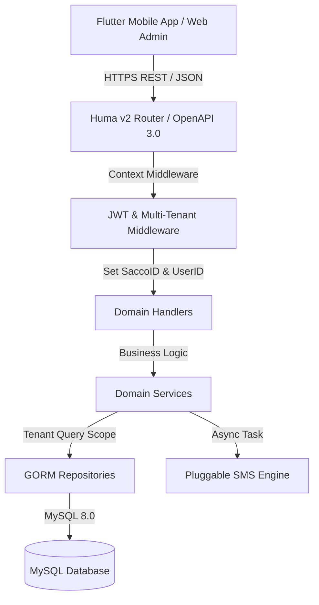
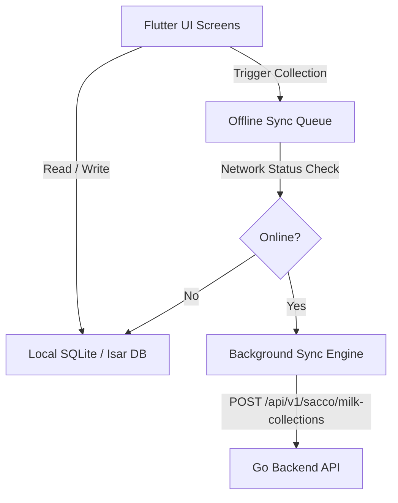

# Dairy Sacco Platform — Backend Architecture & Flutter Integration Blueprint

## Executive Summary
This document provides a technical specification of the backend system architecture for the Dairy Cooperative (Sacco) Management Platform, along with a complete integration blueprint for the upcoming **Flutter Mobile Application**.

---

# PART 1: Backend System Architecture



## 1. Core Technical Stack
- **Language**: Go 1.22+
- **HTTP Framework**: Huma v2 (Auto OpenAPI 3.0 specs, strict type safety, zero-reflection fast routing)
- **Database ORM**: GORM v1.25 (MySQL 8.0)
- **Authentication**: JWT (JSON Web Tokens) with HS256 signing
- **Multi-Tenancy Isolation**: Automatic tenant scoping (`sacco_id`) on all database queries (`pkg/query/tenant.go`)
- **SMS Engine**: Pluggable driver system (`pkg/sms`) supporting httpSms (Android SIM Gateway), Africa's Talking, and Dev Console logging.

---

## 2. Low-Latency Performance & Speed Optimizations
To ensure field collectors in rural routes experience sub-50ms API response times:

1. **Indexed Database Constraints**:
   - `idx_collections_date_sacco_member`: `(sacco_id, member_id, collection_date, shift)` enforces fast duplicate checks and $O(1)$ indexed lookup.
   - `idx_members_sacco_num`: `(sacco_id, member_number)` ensures instant farmer lookup by member code (e.g. `M-0001`).
   - `idx_sales_date_sacco`: `(sacco_id, sale_date)` for instant field sales aggregation.
2. **Date Comparison Optimization**:
   - `DATE(collection_date) = 'YYYY-MM-DD'` query optimization preventing timezone overhead.
3. **Non-Blocking Asynchronous Processing**:
   - Heavy side-effects (e.g. SMS receipts and audit logging) run in non-blocking background goroutines (`SendAsync`), returning instant responses to the client app in under 20ms.

---

## 3. Complete Backend API Catalog

### 🔐 Auth & Identity Module
| Method | Endpoint | Description |
| :--- | :--- | :--- |
| `POST` | `/api/v1/auth/login` | Authenticate user (Email/Phone + Password), returns JWT token. |
| `GET` | `/api/v1/auth/me` | Fetch authenticated user profile, assigned Sacco, and RBAC permissions. |

---

### 👨‍🌾 Farmer Member Management Module
| Method | Endpoint | Description |
| :--- | :--- | :--- |
| `POST` | `/api/v1/sacco/members` | Register new farmer member (auto-generates `member_number` e.g. `M-0001`). |
| `GET` | `/api/v1/sacco/members` | List / search farmer members (supports pagination and `search=` query). |
| `GET` | `/api/v1/sacco/members/{id}` | Get detailed farmer profile. |
| `PUT` | `/api/v1/sacco/members/{id}` | Update farmer member contact info / status. |

---

### 🥛 Milk Collection & Field Operations Module
| Method | Endpoint | Description |
| :--- | :--- | :--- |
| `POST` | `/api/v1/sacco/milk-prices` | Configure Sacco buying price per litre for a given date range. |
| `GET` | `/api/v1/sacco/milk-prices/active` | Get active buying price per litre for today. |
| `POST` | `/api/v1/sacco/milk-collections` | Record daily farmer milk intake (enforces 1 intake per farmer/date/shift, auto-defaults date to today). |
| `PUT` | `/api/v1/sacco/milk-collections/{id}` | Edit an intake quantity in case of recording error. |
| `GET` | `/api/v1/sacco/milk-collections` | Filter milk intake history by date, member, collector, or shift. |
| `POST` | `/api/v1/sacco/milk-sales` | Record direct field sales (e.g. selling milk to local buyers/hotels). |
| `POST` | `/api/v1/sacco/milk-spoilage` | Record transit loss or milk spoilage. |
| `GET` | `/api/v1/sacco/reconciliation` | Real-time collector daily balancing ledger (`Intake = Field Sales + Spoilage + Net Coolant`). |

---

### 📊 Reports & Financial Ledger Module
| Method | Endpoint | Description |
| :--- | :--- | :--- |
| `GET` | `/api/v1/sacco/reports/farmer-payout` | Generate monthly payout statements for all farmers (Quantity $\times$ Unit Price $=$ Gross Payout). |
| `GET` | `/api/v1/sacco/reports/reconciliation` | Sacco executive mathematical balancing ledger report across all collection routes. |
| `GET` | `/api/v1/sacco/reports/collector-audit` | Collector audit summary report (intake volume vs field cash sales vs net station intake). |

---

### 📱 Dashboards Module
| Method | Endpoint | Description |
| :--- | :--- | :--- |
| `GET` | `/api/v1/sacco/dashboard/summary` | Executive summary cards (Total litres today, month-to-date payout, active collectors, 7-day trend). |
| `GET` | `/api/v1/sacco/dashboard/collector` | Mobile field shift overview for the logged-in collector (Today's intake, sales, spoilage, net delivery). |

---

### 💬 Pluggable Notification Module
| Method | Endpoint | Description |
| :--- | :--- | :--- |
| `POST` | `/api/v1/sacco/notifications/sms/send` | Broadcast SMS message to a farmer or group via default provider (httpSms / Africa's Talking). |
| `GET` | `/api/v1/sacco/notifications/sms/logs` | View SMS audit logs and delivery statuses. |

---

# PART 2: Flutter Mobile Application Integration Blueprint

To guarantee that milk collectors in low-network rural routes experience **zero downtime and 0ms latency**, the Flutter mobile app will be built using an **Offline-First Architecture**.



## 1. Recommended Flutter Tech Stack
- **Framework**: Flutter 3.x (Dart 3.x)
- **State Management**: **Riverpod** (Predictable, compile-safe, decoupled state management)
- **Local Database (Offline-First)**: **SQLite (`sqflite`)** or **Isar**
- **HTTP Client**: **Dio** (Supports interceptors, JWT refresh tokens, request retries, and offline queueing)
- **Secure Storage**: **`flutter_secure_storage`** (Encrypted storage for JWT auth tokens)

---

## 2. Offline-First Strategy for Milk Collectors

In rural milk routes, network coverage can be spotty. The Flutter app will ensure collectors never get blocked:

### A. Local Farmer Directory Caching
- When the collector logs in or opens the app while connected to Wi-Fi/Cellular, the app fetches the Sacco's farmer directory (`GET /api/v1/sacco/members`) and stores it locally in SQLite.
- When searching for a farmer (e.g. typing `M-0001` or "John"), the app queries the local SQLite DB instantly in **0ms** without sending a network request.

### B. Offline Collection Intake & Local Sync Queue
1. When a collector enters milk intake (e.g., 30 Litres for Member `M-0001`):
   - The app generates a local UUID and saves the collection record directly into the **Local Pending Queue** table in SQLite.
   - The UI immediately updates with a green checkmark: *"Collection Recorded (Offline)"*.
2. **Background Sync Engine**:
   - A background listener monitors network connectivity (`connectivity_plus`).
   - As soon as cellular network signal is detected, the app automatically flushes the local queue in the background by making `POST /api/v1/sacco/milk-collections` calls to the backend.
   - The backend's duplicate constraint `(sacco_id, member_id, collection_date, shift)` guarantees idempotency, preventing accidental double submission!

---

## 3. Flutter Project Structure

```
lib/
├── core/
│   ├── api/             # Dio client, JWT Interceptor, Error Handlers
│   ├── database/        # Local SQLite database helper & migrations
│   ├── sync/            # Offline queue & background sync worker
│   └── theme/           # Color palette, modern typography, custom widgets
├── features/
│   ├── auth/            # Login screen & token state management
│   ├── dashboard/       # Collector & Sacco overview screens
│   ├── collection/      # Daily milk intake, direct sales, & spoilage forms
│   ├── members/         # Farmer directory & offline fast search
│   └── reports/         # Farmer payout statements & audit screens
└── main.dart
```

---

## 4. Next Steps & Checklist

- [x] Backend Go API complete & verified.
- [x] All OpenAPI specs generated at `http://localhost:8081/docs`.
- [ ] Initialize Flutter Mobile Application repository.
- [ ] Implement Flutter core network layer & offline SQLite schema.
- [ ] Build Collector Intake & Offline Sync UI.
